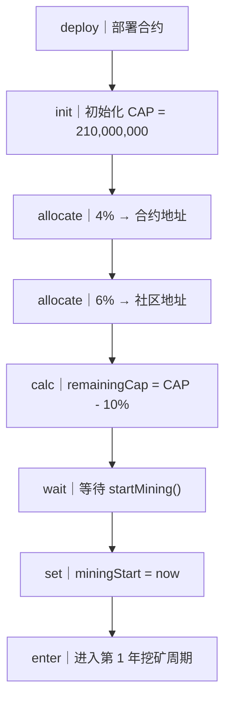
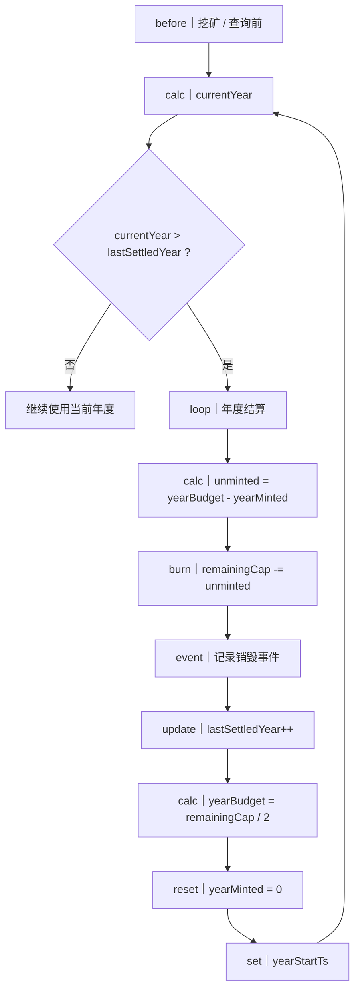
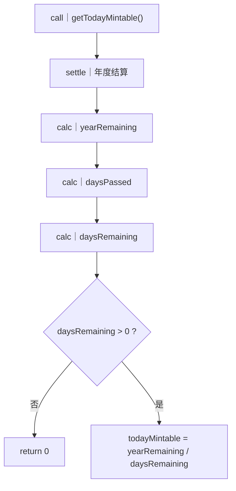
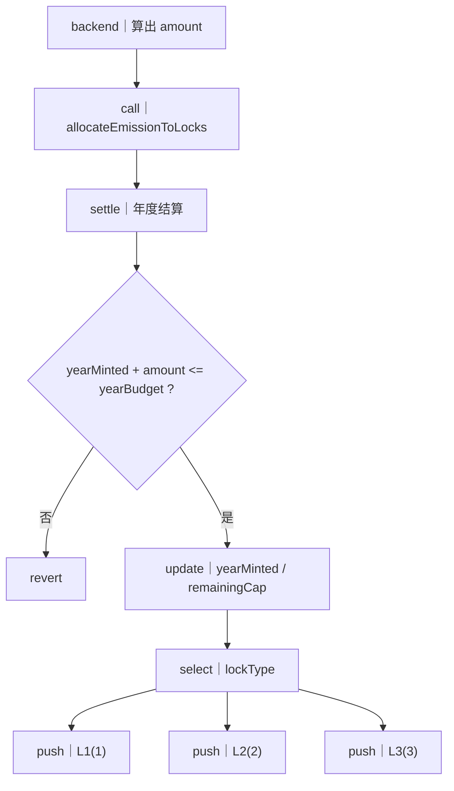
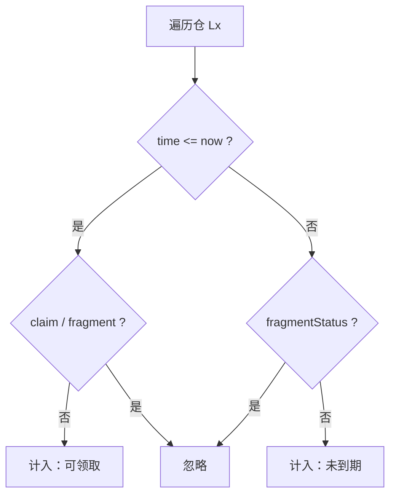
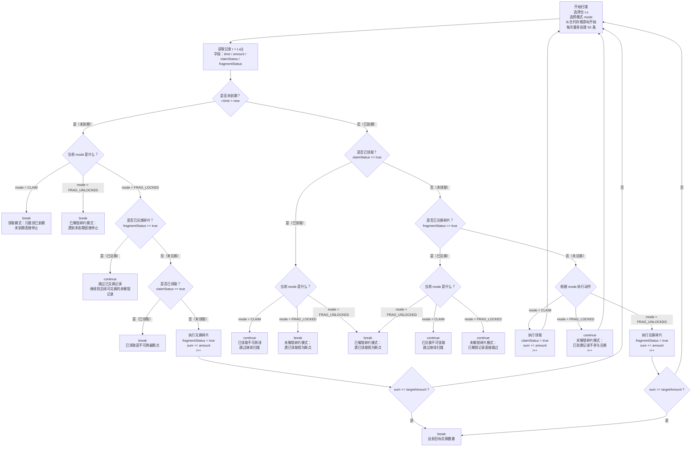

# AiRword 挖矿、发行、锁仓、领取与碎片兑换机制

## 技术设计与执行说明文档（终版 · 全量）

---

# 第一部分：系统总览（全局视角）

## 1. 系统解决的问题是什么

在一个 **总量恒定（CAP = 2.1 亿）** 的前提下，构建一个：

* 不可超发
* 不依赖定时器
* 可跨年补偿结算
* 可审计、可证明
* 同时支持 **锁仓释放 + 碎片金融化**

的长期挖矿发行系统。

---

## 2. 系统的核心思想（非常重要）

> **挖矿 ≠ 直接铸币**

系统中的“挖矿”分为三层含义：

1. **年度层**：决定一年最多能释放多少发行额度
2. **日层**：把年度额度均匀摊到每天
3. **执行层**：把当日确认的发行额度 → 记账进入锁仓

👉 **真正发生 `_mint` 的时间点，只有一个：领取（claim）**
> 例外：
> 1) 部署/初始化阶段的**初始分配 10%** 允许 `_mint`
> 2) `allocateEmissionToLocks` 在 `distType = 2` 时允许**直接分发 `_mint`**。

---

## 3. 模块划分（逻辑解耦）

系统由 6 个模块组成：

1. 初始化与启动模块
2. 年度发行控制模块
3. 日发行额度计算模块
4. 挖矿分发（入仓）模块
5. 锁仓系统（L1 / L2 / L3）
6. 领取与碎片兑换模块

---

# 第二部分：生命周期与发行控制

---

## 一、整体生命周期流程（部署 → 启动挖矿）

### 文字说明（严格执行顺序）

### 1️⃣ 合约部署阶段

* 合约部署完成
* 初始化以下不可变或一次性变量：

```text
CAP = 210,000,000
```

### 2️⃣ 初始分配阶段（不参与挖矿）

* 4% 分配给 **合约地址**
* 6% 分配给 **社区地址**

```text
initialAllocated = CAP * 10%
remainingCap = CAP - initialAllocated
```

> ⚠️ 注意：
> `remainingCap` 是 **整个挖矿系统未来所有年份唯一的燃料池**

---

### 3️⃣ 启动挖矿（显式触发）

合约不会自动开始挖矿，必须调用：

```solidity
startMining()
```

该方法只做一件事：

```text
miningStart = block.timestamp
```

由此：

* 所有“第几年 / 第几天”的计算全部基于该时间
* 在此之前，所有挖矿、查询行为都不可执行

---

### 对应流程图



---

# 第三部分：年度发行与结算（系统核心）

---

## 二、年度结算机制（防错核心）

### 1. 为什么必须显式结算

区块链不会“自动到年末”，因此：

> **每一次与发行相关的操作前，必须检查是否已经跨年**

---

### 2. 年度核心变量说明

| 变量名             | 含义              |
| --------------- | --------------- |
| miningStart     | 挖矿起始时间          |
| currentYear     | 当前处于第几年（从 1 开始） |
| lastSettledYear | 已完成结算的最后一年      |
| yearBudget      | 当前年度最大发行额度      |
| yearMinted      | 当前年度已分发额度       |
| remainingCap    | 尚未分配到任何未来年份的总额度 |

---

### 3. 年度结算触发点（非常重要）

以下所有行为 **必须先调用**：

```solidity
settleToCurrentYear()
```

* allocateEmissionToLocks
* getTodayMintable
* 任何年度统计查询

---

### 4. 年度结算完整逻辑（逐步）

#### Step 1：计算当前年份

```text
currentYear = floor((now - miningStart) / 365 days) + 1
```

---

#### Step 2：是否需要结算

```text
if currentYear <= lastSettledYear:
    return
```

---

#### Step 3：跨年循环结算（可补偿）

```text
while lastSettledYear < currentYear:
```

每一轮循环，结算 **一个完整年度**：

1. 计算未挖完额度：

```text
unminted = yearBudget - yearMinted
```

2. 从剩余总量中扣除（视为销毁）：

```text
remainingCap -= unminted
```

> ⚠️ 这里销毁的是 **发行额度**，不是已 mint 的代币

3. 记录事件：

```solidity
emit UnmintedAllocationBurned(year, unminted)
```

4. 推进到下一年：

```text
lastSettledYear += 1
yearBudget = remainingCap / 2
yearMinted = 0
yearStartTs = 新年度起始时间
```

---

### 对应流程图



---

# 第四部分：日发行额度计算（给后端）

---

## 三、今日可发行量计算

### 设计边界

* 合约 **不关心矿机数量**
* 合约只回答：

> **“今天最多还能分发多少发行额度？”**

---

### 计算步骤

1️⃣ 年度结算
2️⃣ 年度剩余额度：

```text
yearRemaining = yearBudget - yearMinted
```

3️⃣ 已过去天数：

```text
daysPassed = floor((now - yearStartTs) / 1 day)
```

4️⃣ 剩余天数：

```text
daysRemaining = 365 - daysPassed
```

5️⃣ 边界判断：

* 若 `daysRemaining <= 0` → 返回 0

6️⃣ 今日可发行额度：

```text
todayMintable = yearRemaining / daysRemaining
```

---

### 对应流程图



---

# 第五部分：挖矿执行（分发入仓）

---

## 四、挖矿执行的真实含义

> **挖矿执行 = 把当日确认的发行额度，分配进入锁仓或直接分发**

---

## 五、分发接口（已定型）

> 分发入仓时 **由调用方指定仓位**，不再自动拆分。

```solidity
allocateEmissionToLocks(address to, uint256 amount, uint8 lockType, uint8 distType, uint256 orderId)
```

### 入参说明

* `lockType = 1` → L1（解锁时间：now + 1 month）
* `lockType = 2` → L2（解锁时间：now + 2 month）
* `lockType = 3` → L3（解锁时间：now + 4 month）
* `distType = 1` → 入仓
* `distType = 2` → 直接分发（**lockType 必须为 0**）
* `orderId` → 订单号（**按用户唯一**，对 `to` 地址生效）

---

### 执行步骤（严格顺序）

1. 年度结算
2. 校验年度上限：

```text
require(yearMinted + amount <= yearBudget)
```

3. 扣减全局额度：

```text
yearMinted += amount
remainingCap -= amount
```

4. 校验分发类型：
    * `distType` 必须为 `1/2`
    * 若 `distType = 2`，`lockType` 必须为 `0`
5. 校验订单号：`orderId` 在 `to` 地址下不得重复
6. 根据 `distType` 执行：
    * `distType = 1` → 按 `lockType` 写入指定锁仓
    * `distType = 2` → **直接 `_mint` 给用户**（不写入锁仓记录）

* 1 → L1：now + 1 month
* 2 → L2：now + 2 month
* 3 → L3：now + 4 month

---

### 对应流程图



---

# 第六部分：锁仓系统（L1 / L2 / L3）

---

## 六、锁仓结构定义

```text
LockRecord {
  time            // 解锁时间戳
  amount          // 额度
  claimStatus     // 是否已领取
  fragmentStatus  // 是否已兑换碎片
}
```

### 状态不变量

```text
claimStatus == true → fragmentStatus == false
fragmentStatus == true → claimStatus == false
```

---

## 七、锁仓查询能力（必须支持）

### 单仓统计维度

| 统计项 | 含义                    |
| --- | --------------------- |
| 可领取 | time <= now 且未领取未兑换   |
| 未到期 | time > now 且未兑换       |
| 已领取 | claimStatus = true    |
| 已兑换 | fragmentStatus = true |

---

### 查询流程图（通用）



---

# 第七部分：领取与碎片兑换（三种模式）

---

## 八、操作模式定义

| mode          | 含义         |
| ------------- | ---------- |
| CLAIM         | 一键领取（需指定仓位，管理员代用户执行） |
| FRAG_LOCKED   | 兑换未解锁碎片    |
| FRAG_UNLOCKED | 兑换已解锁未领取碎片 |

---

> 注：CLAIM / FRAG_LOCKED / FRAG_UNLOCKED 均需指定仓位（L1 / L2 / L3）。
> 其中 CLAIM / FRAG_* 由管理员代用户执行，需用户授权。

### 仓位参数约定（通用）

* `lockType = 1` → L1
* `lockType = 2` → L2
* `lockType = 3` → L3

## 九、统一扫描决策流程（终极闭环）




---

## 九点一、一键领取销毁规则（仅 CLAIM 模式生效）

> 仅作用于 **CLAIM（一键领取）**，对 **FRAG_LOCKED / FRAG_UNLOCKED** 无影响。
> 领取完成后，必须将对应锁仓记录的 `claimStatus` 标记为已领取，防止后续重复领取或兑换。

### 规则说明（按选择仓统计）

* 先**选择仓类型（L1 / L2 / L3）**，只在**该仓**内统计本次可领取总额
* 只在领取时 `_mint`
* 领取时 **先 mint，再 burn**

### 销毁比例（针对“可领取金额”的比例）

| 仓类型 | 销毁比例 | 实际分发比例 |
| ---- | ---- | ------ |
| L1   | 75%  | 25%    |
| L2   | 50%  | 50%    |
| L3   | 0%   | 100%   |

### 执行步骤（CLAIM）

1. 管理员代用户执行，校验用户授权
2. 选择仓类型 `Lx`（L1 / L2 / L3）
3. 校验订单号：`orderId` 在用户地址下不得重复
4. 仅扫描 `Lx` 内所有**已到期且未领取/未兑换**的记录
5. 累计 `claimableLx`
6. 先 `_mint` 全量 `claimableLx` 到合约自身
7. 按仓类型执行 `burn`（只对当前 `Lx` 生效）：
    * 若 `Lx = L1`，`burnLx = claimableLx * 75%`
    * 若 `Lx = L2`，`burnLx = claimableLx * 50%`
    * 若 `Lx = L3`，`burnLx = 0`
8. 实际到账：
    * `netLx = claimableLx - burnLx`
9. 将 `netLx` 转账给用户
10. 将本次领取到的 `Lx` 记录逐条 `claimStatus = true`
11. 写入订单记录（含 `amount/burnAmount/netAmount/timestamp/status`）
12. 触发事件（示例）：

```solidity
emit ClaimWithBurn(user, claimableLx, burnLx, netLx, Lx);
```

> 注：事件字段可按实现调整，但必须能审计本次 L1/L2 的销毁量与净领取量。

# 九点二、领取预览（仅 CLAIM）

```solidity
previewClaimable(address user, uint8 lockType) returns (uint256 claimable, uint256 burnAmount, uint256 netAmount, uint256 processed, uint256 nextCursor)
```

### 规则

* 仅用于 CLAIM 领取预览，不用于兑换
* 仅扫描**合约当前游标位置之后最多 50 条**
    * 游标键：`user + lockType + CLAIM`
* 返回本次“实际可领取的最大数量”（与 `claimAll` 同口径）

## 九点三、关键实现约定（已确认）

### 已确认

1. `startMining` 仅允许调用一次；重复调用**忽略**（不改变任何状态）。
2. `exchangeLockedFragment / exchangeUnlockedFragment`：先计算可兑换数量，若 `< targetAmount` 则**不执行任何状态变更并返回错误**。
3. 时间常量固定：`month = 30 days`，`year = 365 days`。
4. 兑换碎片时执行顺序：**先 `_mint` 再 `_burn`**（碎片不需要独立载体，`_mint/_burn` 均为本币；**不转账给用户**，执行完成返回本次执行数量，后端自行记账）。
5. `getLockStats` 返回结构体/元组（不返回 JSON 字符串）。
6. 第一年初始化建议方案确定为：
    * `startMining` 设置 `yearBudget = remainingCap / 2`、`yearMinted = 0`、`yearStartTs = miningStart`、`lastSettledYear = 0`
    * `settleToCurrentYear` 只结算**已结束的年度**：
      `while (lastSettledYear + 1 < currentYear) { ... }`
7. 扫描类接口使用**合约存储游标**，每次最多遍历 **50 条**（合约内固定上限，不作为入参），且**不提供重置游标**功能。
    * 游标键：`user + lockType + mode` 独立存储。
    * 遇到“未到期 break”时，游标停留在**未到期记录的位置**（前序已处理完）。
8. L1/L2 领取与兑换碎片时的执行方式：
    * 领取（CLAIM）：合约先 `_mint` 到自身 → `burn` 销毁比例部分 → `transfer` 净额给用户
    * 兑换碎片：合约先 `_mint` 到自身 → **全量** `burn`（不转账）
9. 新增 `previewClaimable(user, lockType)`：只查看**当前合约游标之后最多 50 条**记录，返回“本次可实际领取的最大数量”（不支持兑换预览）。
10. `getLockStats` 允许**一次性全量遍历**该仓全部记录，建议仅用于 `view` 调用（链上调用可能超出 gas）。
    * 若数据量很大，使用 `getLockStatsPaged` 分页统计。
11. 权限控制：`startMining`、`allocateEmissionToLocks`、矿机分发相关入口需**管理员**权限。
    * `exchangeLockedFragment / exchangeUnlockedFragment` 也需**管理员**调用，并要求**用户授权**（链上授权表）。
    * 授权方式：用户调用 `approveOperator(operator, approved)`，合约校验 `operator` 是否被授权。
    * 合约部署者拥有所有权限（**唯一可调用 `setAdmin`**），管理员不具备设置管理员权限。
    * `claimAll` 需**管理员**调用，并要求**用户授权**。
12. 返回值口径：
* `claimAll` 返回**净到账数量**
* `exchangeLockedFragment / exchangeUnlockedFragment` 返回**本次执行数量**
13. 订单号：
* `orderId` 类型为 `uint256`
* **按用户唯一**，重复直接报错
* `allocateEmissionToLocks` 以 `to` 作为订单归属用户
* `claimAll` 以 `user` 作为订单归属用户
* `exchange*` 以 `user` 作为订单归属用户
* 订单查询需 `user + orderId`
14. 扫描上限可配置：
* 管理员可设置 `maxScanLimit`
* `estimateMaxCount(perRecordGas, fixedGas)` 返回理论建议值

## 九点四、执行细节补充

1. 初始分配 10% 在部署/初始化时 `_mint`，作为“仅领取时 mint”的**唯一例外**。
2. 兑换碎片不转账本币，执行流程为“合约 `_mint` → 全量 `_burn` → 返回执行数量”。
3. `previewClaimable` 返回字段确认：`claimable / burnAmount / netAmount / processed / nextCursor`。
4. 订单记录写入：
    * 仅在执行成功后写入订单记录；若订单号重复则直接报错，不写入。
    * `status` 写入为 `0=成功`（失败场景无记录）。
    * `amount` 口径：`allocate=amount`，`exchange=targetAmount`，`claim=0`。
    * `executedAmount` 口径：`allocate=amount`，`claim=claimableLx`，`exchange=本次执行数量`。
    * `distType=2（直接分发）` 时：
        * `methodType=ALLOCATE`（不新增类型）
        * `amount=amount`
        * `executedAmount=amount`
        * `netAmount=amount`
        * `burnAmount=0`
    * `netAmount` 仅 `claim` 与 `distType=2` 有意义，其它方法为 `0`。
5. `exchangeLockedFragment / exchangeUnlockedFragment` 为**管理员调用**，需校验**用户授权**（链上授权表）。
6. 授权机制（链上授权表）建议：
    * `mapping(user => mapping(operator => bool))`
    * 用户调用 `approveOperator(operator, approved)` 设置授权
    * 管理员调用 `exchange*` 时校验 `approved == true`


# 第八部分：字段 & 方法完整对照表

---

## 十、核心字段表

| 字段                | 含义     |
| ----------------- | ------ |
| CAP               | 总发行上限  |
| remainingCap      | 剩余可挖额度 |
| miningStart       | 挖矿起始时间 |
| yearBudget        | 当年最大发行 |
| yearMinted        | 当年已分发  |
| LockRecord.time   | 解锁时间   |
| LockRecord.amount | 锁仓额度   |
| claimStatus       | 是否已领取  |
| fragmentStatus    | 是否已兑换  |

---

## 十一、方法说明表

| 方法名                      | 含义      | 入参         | 返回      |
| ------------------------ | ------- | ---------- | ------- |
| startMining              | 启动挖矿    | 无          | 无       |
| settleToCurrentYear      | 年度结算    | 无          | 无       |
| getTodayMintable         | 今日最大发行量 | 无          | uint256 |
| allocateEmissionToLocks  | 分发额度（入仓/直接） | to, amount, lockType, distType, orderId | 无       |
| claimAll                 | 管理员代用户领取（指定仓位，含 L1/L2 销毁规则） | user, lockType, orderId | uint256 |
| exchangeLockedFragment   | 管理员代用户兑换未解锁碎片（指定仓位） | user, lockType, target, orderId | uint256 |
| exchangeUnlockedFragment | 管理员代用户兑换已解锁碎片（指定仓位） | user, lockType, target, orderId | uint256 |
| getLockStats             | 查询锁仓统计（指定仓位） | user, lockType | 多字段     |
| getLockStatsPaged        | 查询锁仓统计（分页） | user, lockType, cursor | 多字段     |
| previewClaimable         | 领取预览（仅 CLAIM） | user, lockType | 多字段     |
| getOrder                 | 订单查询（按订单号） | user, orderId | 多字段     |
| approveOperator          | 授权管理员操作 | operator, approved | 无 |
| setAdmin                 | 设置管理员（仅部署者） | newAdmin | 无 |
| setMaxScanLimit          | 设置扫描上限 | limit | 无 |
| getMaxScanLimit          | 查询扫描上限 | 无 | uint256 |
| estimateMaxCount         | 预估建议上限 | perRecordGas, fixedGas | uint256 |

---

## 十二、getLockStats 返回字段（结构体/元组）

| 字段名 | 含义 |
| --- | --- |
| totalCount | 该仓总记录数 |
| totalAmount | 该仓总额度 |
| claimableCount | 可领取记录数（已到期且未领取未兑换） |
| claimableAmount | 可领取额度 |
| unmaturedCount | 未到期记录数 |
| unmaturedAmount | 未到期额度 |
| claimedCount | 已领取记录数 |
| claimedAmount | 已领取额度 |
| fragmentedCount | 已兑换碎片记录数 |
| fragmentedAmount | 已兑换碎片额度 |
| earliestUnlockTime | 最近一次可解锁时间（用于前端倒计时） |
| latestUnlockTime | 最晚解锁时间 |
| lastIndex | 最后一条记录索引（便于分页） |

---

## 十三、接口签名（外部可见）

```solidity
// 仅管理员
function startMining() external;

// 年度结算（对外可调用，内部操作前也会调用）
function settleToCurrentYear() public;

// 今日最大发行量（只读）
function getTodayMintable() external view returns (uint256);

// 仅管理员：分发额度（入仓/直接）
function allocateEmissionToLocks(address to, uint256 amount, uint8 lockType, uint8 distType, uint256 orderId) external;

// 仅管理员：代用户一键领取（指定仓位，返回净到账数量）
// 注意：需要用户授权
function claimAll(address user, uint8 lockType, uint256 orderId) external returns (uint256);

// 仅管理员：兑换未解锁碎片（返回本次执行数量）
// 注意：需要用户授权
function exchangeLockedFragment(address user, uint8 lockType, uint256 targetAmount, uint256 orderId) external returns (uint256);

// 仅管理员：兑换已解锁碎片（返回本次执行数量）
// 注意：需要用户授权
function exchangeUnlockedFragment(address user, uint8 lockType, uint256 targetAmount, uint256 orderId) external returns (uint256);

// 锁仓统计（全量遍历，仅建议 view 调用）
function getLockStats(address user, uint8 lockType) external view returns (LockStats memory);

// 锁仓统计（分页遍历）
function getLockStatsPaged(address user, uint8 lockType, uint256 cursor)
    external
    view
    returns (LockStats memory stats, uint256 nextCursor, uint256 processed, bool finished);

// 领取预览（仅 CLAIM）
function previewClaimable(address user, uint8 lockType) external view returns (PreviewClaimable memory);

// 订单查询（按用户 + 订单号）
function getOrder(address user, uint256 orderId) external view returns (OrderRecord memory);

// 用户授权管理员操作
function approveOperator(address operator, bool approved) external;

// 仅部署者：设置管理员
function setAdmin(address newAdmin) external;

// 仅管理员：设置扫描上限
function setMaxScanLimit(uint256 limit) external;

// 查询扫描上限
function getMaxScanLimit() external view returns (uint256);

// 预估建议上限（用于前端/后端估算）
function estimateMaxCount(uint256 perRecordGas, uint256 fixedGas) external view returns (uint256);
```

---

## 十四、构造函数（部署阶段）

```solidity
constructor(address admin, address communityAddress) {
    // 部署时执行初始分配
    // 4% → 合约地址（用于后续锁仓/领取）
    // 6% → 社区地址（communityAddress）
}
```

### 约束说明

* `communityAddress` 不能为空地址
* `admin` 不能为空地址
* 初始分配在部署时 `_mint`（作为“仅领取时 mint”的唯一例外）
* 合约部署者为超级管理员：拥有所有权限且**唯一可调用 `setAdmin`**

---

## 十五、结构体定义（补齐）

```solidity
// 锁仓记录
struct LockRecord {
    uint256 time;            // 解锁时间戳
    uint256 amount;          // 额度
    bool claimStatus;        // 是否已领取
    bool fragmentStatus;     // 是否已兑换碎片
}

// 锁仓统计返回
struct LockStats {
    uint256 totalCount;
    uint256 totalAmount;
    uint256 claimableCount;
    uint256 claimableAmount;
    uint256 unmaturedCount;
    uint256 unmaturedAmount;
    uint256 claimedCount;
    uint256 claimedAmount;
    uint256 fragmentedCount;
    uint256 fragmentedAmount;
    uint256 earliestUnlockTime;
    uint256 latestUnlockTime;
    uint256 lastIndex;
}

// 领取预览返回
struct PreviewClaimable {
    uint256 claimable;   // 本次可领取总额
    uint256 burnAmount;  // 本次应销毁数量
    uint256 netAmount;   // 本次实际到账数量
    uint256 processed;   // 本次处理条数
    uint256 nextCursor;  // 下一游标位置（仅计算，不入库）
}

// 订单类型
enum OrderMethodType {
    ALLOCATE,         // 分发入仓
    CLAIM,            // 领取
    EXCHANGE_LOCKED,  // 兑换未解锁碎片
    EXCHANGE_UNLOCKED // 兑换已解锁碎片
}

// 订单记录
struct OrderRecord {
    OrderMethodType methodType; // 方法类型
    address user;               // 订单归属用户
    uint8 lockType;             // 仓位
    uint256 amount;             // 数量入参（allocate=amount / exchange=targetAmount / claim=0）
    uint256 executedAmount;     // 本次实际执行数量
    uint256 netAmount;          // 实际到账数量（仅领取有意义）
    uint256 burnAmount;         // 本次销毁数量
    uint256 timestamp;          // 执行时间
    uint8 status;               // 执行状态（0=成功，1=失败）
}
```

---

## 十六、事件清单

```solidity
// 年度结算：未挖完额度销毁
event UnmintedAllocationBurned(uint256 year, uint256 unminted);

// 领取销毁明细
event ClaimWithBurn(
    address indexed user,
    uint256 claimable,
    uint256 burnAmount,
    uint256 netAmount,
    uint8 lockType
);

// 直接分发事件
event DirectDistributed(
    address indexed to,
    uint256 amount,
    uint256 orderId,
    uint256 timestamp
);
```

> 如需审计入仓或兑换细节，可在实现中补充对应事件。

---

## 十七、错误返回结构（建议）

> 说明：Solidity 通常使用 `revert` 抛错，返回结构建议采用自定义错误码。

```solidity
error BizError(uint8 code);
```

### 错误码定义（建议）

| code | 错误名 | 含义 |
| --- | --- | --- |
| 1 | NOT_ADMIN | 非管理员调用 |
| 2 | MINING_NOT_STARTED | 挖矿未启动 |
| 3 | INVALID_LOCK_TYPE | 仓位参数非法（非 1/2/3） |
| 4 | ORDER_ID_DUPLICATE | 订单号重复 |
| 5 | ANNUAL_BUDGET_EXCEEDED | 年度额度不足 |
| 6 | EXCHANGE_TARGET_NOT_MET | 可兑换数量不足 target |
| 7 | NO_CLAIMABLE | 本次无可领取数量 |
| 8 | ORDER_NOT_FOUND | 订单不存在 |
| 9 | NOT_AUTHORIZED | 未获得用户授权 |
| 10 | INVALID_DIST_TYPE | 分发类型非法（非 1/2） |
| 11 | INVALID_GAS_PARAM | 预估参数非法（如 0） |
| 12 | ZERO_AMOUNT | 数量为 0 |
| 13 | INVALID_ADDRESS | 地址非法（零地址） |
| 14 | CAP_EXCEEDED | 超出总量上限 |
| 15 | INSUFFICIENT_BALANCE | 余额不足 |
| 16 | INSUFFICIENT_ALLOWANCE | 授权额度不足 |

---

## 十八、方法报错清单（基于已确认规则）

### startMining
* `NOT_ADMIN`：非管理员调用

### setAdmin
* `NOT_ADMIN`：非部署者调用
* `INVALID_ADDRESS`：新管理员为零地址

### settleToCurrentYear
* `MINING_NOT_STARTED`：挖矿未启动

### getTodayMintable
* `MINING_NOT_STARTED`：挖矿未启动

### allocateEmissionToLocks
* `NOT_ADMIN`：非管理员调用
* `MINING_NOT_STARTED`：挖矿未启动
* `INVALID_LOCK_TYPE`：仓位非法
* `INVALID_DIST_TYPE`：分发类型非法
* `ORDER_ID_DUPLICATE`：订单号重复
* `ANNUAL_BUDGET_EXCEEDED`：年度额度不足
* `ZERO_AMOUNT`：数量为 0
* `CAP_EXCEEDED`：超出总量上限

### claimAll
* `NOT_ADMIN`：非管理员调用
* `MINING_NOT_STARTED`：挖矿未启动
* `INVALID_LOCK_TYPE`：仓位非法
* `ORDER_ID_DUPLICATE`：订单号重复
* `NO_CLAIMABLE`：本次无可领取数量
* `NOT_AUTHORIZED`：未获得用户授权
* `CAP_EXCEEDED`：超出总量上限

### exchangeLockedFragment / exchangeUnlockedFragment
* `NOT_ADMIN`：非管理员调用
* `MINING_NOT_STARTED`：挖矿未启动
* `INVALID_LOCK_TYPE`：仓位非法
* `ORDER_ID_DUPLICATE`：订单号重复
* `EXCHANGE_TARGET_NOT_MET`：可兑换数量不足 target
* `NOT_AUTHORIZED`：未获得用户授权
* `CAP_EXCEEDED`：超出总量上限

### previewClaimable
* `MINING_NOT_STARTED`：挖矿未启动
* `INVALID_LOCK_TYPE`：仓位非法

### getLockStats
* `MINING_NOT_STARTED`：挖矿未启动
* `INVALID_LOCK_TYPE`：仓位非法

### getOrder
* `MINING_NOT_STARTED`：挖矿未启动
* `ORDER_NOT_FOUND`：订单不存在

### approveOperator
* 当前未定义业务错误码（如需校验参数可新增错误码）

---

#合约代码
```
## AiRword Aion (AION) (项目代币) 合约:
合约地址: 0xa008BC1bDDa6dE14F9e834e7A671098C6AA55f40
合约代码:
// SPDX-License-Identifier: MIT
pragma solidity ^0.8.20;

/// @title AiRword Aion (AiRWord_v3)
/// @notice 依据 air.md 文档实现的合约（中文注释与中文日志）
contract AiRWord_v3 {
// =========================
// 基础常量与元数据
// =========================
string public constant NAME = "AiRword Aion";
string public constant SYMBOL = "AiRword";
uint8 public constant DECIMALS = 18;
uint256 public constant CAP = 210_000_000 * 10 ** uint256(DECIMALS);

    // 时间常量
    uint256 private constant MONTH = 1 minutes;
    uint256 private constant YEAR = 365 days;

    // =========================
    // 错误码（BizError）
    // =========================
    error BizError(uint8 code);

    uint8 private constant NOT_ADMIN = 1;
    uint8 private constant MINING_NOT_STARTED = 2;
    uint8 private constant INVALID_LOCK_TYPE = 3;
    uint8 private constant ORDER_ID_DUPLICATE = 4;
    uint8 private constant ANNUAL_BUDGET_EXCEEDED = 5;
    uint8 private constant EXCHANGE_TARGET_NOT_MET = 6;
    uint8 private constant NO_CLAIMABLE = 7;
    uint8 private constant ORDER_NOT_FOUND = 8;
    uint8 private constant NOT_AUTHORIZED = 9;
    uint8 private constant INVALID_DIST_TYPE = 10;
    uint8 private constant INVALID_GAS_PARAM = 11;
    uint8 private constant ZERO_AMOUNT = 12;
    uint8 private constant INVALID_ADDRESS = 13;
    uint8 private constant CAP_EXCEEDED = 14;
    uint8 private constant INSUFFICIENT_BALANCE = 15;
    uint8 private constant INSUFFICIENT_ALLOWANCE = 16;

    // =========================
    // 角色与权限
    // =========================
    address public immutable owner; // 合约部署者（超级管理员）
    address public admin; // 管理员（由部署者设置）
    address public immutable community; // 社区地址

    // =========================
    // ERC20 存储
    // =========================
    // 代币总供应量（最小单位）
    uint256 private _totalSupply;

    // 账户余额映射：地址 => 余额
    mapping(address => uint256) private _balances;

    // 授权额度映射：授权人 => 被授权人 => 授权额度
    mapping(address => mapping(address => uint256)) private _allowances;


    // =========================
    // 挖矿与发行状态
    // =========================
    uint256 public miningStart;     // 挖矿起始时间
    uint256 public lastSettledYear; // 已完成结算的最后一年
    uint256 public yearBudget;      // 当前年度最大发行额度
    uint256 public yearMinted;      // 当前年度已分发额度
    uint256 public remainingCap;    // 剩余可挖额度（全局总量，不是当年额度）
    uint256 public yearStartTs;     // 当前年度起始时间

    // =========================
    // 扫描上限
    // =========================
    uint256 public maxScanLimit = 100;

    // =========================
    // 数据结构
    // =========================
    struct LockRecord {
        uint256 time;           // 解锁时间戳
        uint256 amount;         // 额度
        bool claimStatus;       // 是否已领取
        bool fragmentStatus;    // 是否已兑换碎片
    }

    struct LockStats {
        uint256 totalCount;         // 该仓总记录数
        uint256 totalAmount;        // 该仓总额度
        uint256 claimableCount;     // 可领取记录数（已到期且未领取未兑换）
        uint256 claimableAmount;    // 可领取额度
        uint256 unmaturedCount;     // 未到期记录数
        uint256 unmaturedAmount;    // 未到期额度
        uint256 claimedCount;       // 已领取记录数
        uint256 claimedAmount;      // 已领取额度
        uint256 fragmentedCount;    // 已兑换碎片记录数
        uint256 fragmentedAmount;   // 已兑换碎片额度
        uint256 earliestUnlockTime; // 最近一次可解锁时间（用于前端倒计时）
        uint256 latestUnlockTime;   // 最晚解锁时间
        uint256 lastIndex;          // 最后一条记录索引（便于分页）
    }

    struct PreviewClaimable {
        uint256 claimable;   // 本次可领取总额
        uint256 burnAmount;  // 本次应销毁数量
        uint256 netAmount;   // 本次实际到账数量
        uint256 processed;   // 本次处理条数
        uint256 nextCursor;  // 下一游标位置（仅计算，不入库）
    }

    enum OrderMethodType {
        ALLOCATE,         // 分发入仓 / 直接分发
        CLAIM,            // 领取
        EXCHANGE_LOCKED,  // 兑换未解锁碎片
        EXCHANGE_UNLOCKED // 兑换已解锁碎片
    }

    struct OrderRecord {
        OrderMethodType methodType; // 方法类型
        address user;               // 订单归属用户
        uint8 lockType;             // 仓位
        uint256 amount;             // 数量入参（allocate=amount / exchange=targetAmount / claim=0）
        uint256 executedAmount;     // 本次实际执行数量
        uint256 netAmount;          // 实际到账数量（仅领取有意义）
        uint256 burnAmount;         // 本次销毁数量
        uint256 timestamp;          // 执行时间
        uint8 status;               // 执行状态（0=成功，1=失败）
    }

    // =========================
    // 存储映射
    // =========================
    // 用户锁仓：user => lockType => records
    mapping(address => mapping(uint8 => LockRecord[])) private _locks;

    // 游标：user => lockType => mode => cursor
    mapping(address => mapping(uint8 => mapping(uint8 => uint256))) private _cursors;

    // 订单记录：user => orderId => record
    mapping(address => mapping(uint256 => OrderRecord)) private _orders;
    mapping(address => mapping(uint256 => bool)) private _orderExists;

    // 用户授权：user => operator => approved
    mapping(address => mapping(address => bool)) private _operatorApproved;

    // 模式常量（用于游标）
    uint8 private constant MODE_CLAIM = 0;
    uint8 private constant MODE_FRAG_LOCKED = 1;
    uint8 private constant MODE_FRAG_UNLOCKED = 2;

    // =========================
    // 事件（日志输出）
    // =========================
    event Transfer(address indexed from, address indexed to, uint256 value);
    event Approval(address indexed owner, address indexed spender, uint256 value);

    // 年度结算：未挖完额度销毁
    event UnmintedAllocationBurned(uint256 year, uint256 unminted);

    // 领取销毁明细
    event ClaimWithBurn(
        address indexed user,
        uint256 claimable,
        uint256 burnAmount,
        uint256 netAmount,
        uint8 lockType
    );

    // 直接分发事件
    event DirectDistributed(
        address indexed to,
        uint256 amount,
        uint256 orderId,
        uint256 timestamp
    );

    // =========================
    // 构造函数（部署阶段）
    // =========================
    constructor(address admin_, address communityAddress) {
        if (admin_ == address(0) || communityAddress == address(0)) {
            revert BizError(INVALID_ADDRESS);
        }

        owner = msg.sender;
        admin = admin_;
        community = communityAddress;

        // 初始分配（唯一例外可 mint）
        uint256 toContract = (CAP * 4) / 100;
        uint256 toCommunity = (CAP * 6) / 100;
        _mint(address(this), toContract);
        _mint(communityAddress, toCommunity);

        // 初始化剩余可挖额度
        remainingCap = CAP - toContract - toCommunity;
    }

    // =========================
    // ERC20 基础接口
    // =========================
    function name() external pure returns (string memory) {
        return NAME;
    }

    function symbol() external pure returns (string memory) {
        return SYMBOL;
    }

    function decimals() external pure returns (uint8) {
        return DECIMALS;
    }

    function totalSupply() external view returns (uint256) {
        return _totalSupply;
    }

    function balanceOf(address account) external view returns (uint256) {
        return _balances[account];
    }

    function allowance(address owner_, address spender) external view returns (uint256) {
        return _allowances[owner_][spender];
    }

    function transfer(address to, uint256 amount) external returns (bool) {
        _transfer(msg.sender, to, amount);
        return true;
    }

    function approve(address spender, uint256 amount) external returns (bool) {
        _approve(msg.sender, spender, amount);
        return true;
    }

    function transferFrom(address from, address to, uint256 amount) external returns (bool) {
        uint256 current = _allowances[from][msg.sender];
        if (current < amount) {
            revert BizError(INSUFFICIENT_ALLOWANCE);
        }
        _approve(from, msg.sender, current - amount);
        _transfer(from, to, amount);
        return true;
    }

    // =========================
    // 权限与管理员
    // =========================
    function setAdmin(address newAdmin) external {
        // 仅部署者可设置管理员
        if (msg.sender != owner) {
            revert BizError(NOT_ADMIN);
        }
        if (newAdmin == address(0)) {
            revert BizError(INVALID_ADDRESS);
        }
        admin = newAdmin;
    }

    function approveOperator(address operator, bool approved) external {
        // 用户授权管理员操作
        _operatorApproved[msg.sender][operator] = approved;
    }

    // =========================
    // 扫描上限配置
    // =========================
    function setMaxScanLimit(uint256 limit) external onlyAdmin {
        maxScanLimit = limit;
    }

    function getMaxScanLimit() external view returns (uint256) {
        return maxScanLimit;
    }

    function estimateMaxCount(uint256 perRecordGas, uint256 fixedGas) external view returns (uint256) {
        // 预估建议上限：根据区块 gasLimit 反推出可安全处理的最大条数
        // perRecordGas：每条记录预计消耗 gas
        // fixedGas：固定开销（不随记录数变化）
        if (perRecordGas == 0 || fixedGas == 0) {
            revert BizError(INVALID_GAS_PARAM);
        }
        uint256 gasLimit = block.gaslimit;
        if (gasLimit <= fixedGas) {
            return 0;
        }
        uint256 suggested = (gasLimit - fixedGas) / perRecordGas;
        if (suggested > maxScanLimit) {
            return maxScanLimit;
        }
        return suggested;
    }

    // =========================
    // 启动挖矿
    // =========================
    function startMining() external onlyAdmin {
        // 重复调用忽略
        if (miningStart != 0) {
            return;
        }
        miningStart = block.timestamp;
        yearStartTs = miningStart;
        yearBudget = remainingCap / 2;
        yearMinted = 0;
        lastSettledYear = 0;
    }

    // =========================
    // 年度结算
    // =========================
    function settleToCurrentYear() public {
        _requireStarted();
        uint256 currentYear = _currentYear();
        while (lastSettledYear + 1 < currentYear) {
            uint256 unminted = yearBudget - yearMinted;
            remainingCap -= unminted;
            emit UnmintedAllocationBurned(lastSettledYear + 1, unminted);
            lastSettledYear += 1;
            yearBudget = remainingCap / 2;
            yearMinted = 0;
            yearStartTs = miningStart + (lastSettledYear * YEAR);
        }
    }

    // =========================
    // 今日可发行量（只读）
    // =========================
    function getTodayMintable() external view returns (uint256) {
        _requireStartedView();
        (uint256 budget, uint256 minted, uint256 startTs) = _simulateToCurrentYear();
        uint256 yearRemaining = budget - minted;
        uint256 daysPassed = (block.timestamp - startTs) / 1 days;
        if (daysPassed >= 365) {
            return 0;
        }
        uint256 daysRemaining = 365 - daysPassed;
        return yearRemaining / daysRemaining;
    }

    // =========================
    // 分发额度（入仓/直接）
    // =========================
    function allocateEmissionToLocks(
        address to,
        uint256 amount,
        uint8 lockType,
        uint8 distType,
        uint256 orderId
    ) external onlyAdmin {
        _requireStarted();

        if (to == address(0)) {
            revert BizError(INVALID_ADDRESS);
        }
        if (amount == 0) {
            revert BizError(ZERO_AMOUNT);
        }
        if (distType != 1 && distType != 2) {
            revert BizError(INVALID_DIST_TYPE);
        }
        if (distType == 2) {
            if (lockType != 0) {
                revert BizError(INVALID_LOCK_TYPE);
            }
        } else {
            if (!_isValidLockType(lockType)) {
                revert BizError(INVALID_LOCK_TYPE);
            }
        }

        _requireOrderNotExists(to, orderId);

        settleToCurrentYear();

        if (yearMinted + amount > yearBudget) {
            revert BizError(ANNUAL_BUDGET_EXCEEDED);
        }

        yearMinted += amount;
        remainingCap -= amount;

        if (distType == 1) {
            _pushLock(to, lockType, amount);
        } else {
            // 直接分发：直接 mint 给用户
            _mint(to, amount);
            emit DirectDistributed(to, amount, orderId, block.timestamp);
        }

        // 写入订单记录（ALLOCATE）
        OrderRecord storage r = _orders[to][orderId];
        r.methodType = OrderMethodType.ALLOCATE;
        r.user = to;
        r.lockType = lockType;
        r.amount = amount;
        r.executedAmount = amount;
        r.netAmount = (distType == 2) ? amount : 0;
        r.burnAmount = 0;
        r.timestamp = block.timestamp;
        r.status = 0;
        _orderExists[to][orderId] = true;
    }

    // =========================
    // 一键领取（指定仓位）
    // =========================
    function claimAll(address user, uint8 lockType, uint256 orderId) external onlyAdmin returns (uint256) {
        _requireStarted();
        if (!_isValidLockType(lockType)) {
            revert BizError(INVALID_LOCK_TYPE);
        }
        if (!_operatorApproved[user][msg.sender]) {
            revert BizError(NOT_AUTHORIZED);
        }
        _requireOrderNotExists(user, orderId);

        settleToCurrentYear();

        uint256 cursor = _cursors[user][lockType][MODE_CLAIM];
        LockRecord[] storage list = _locks[user][lockType];
        uint256 len = list.length;
        uint256 i = cursor;
        uint256 processed = 0;
        uint256 claimable = 0;

        while (i < len && processed < maxScanLimit) {
            processed++;
            LockRecord storage rec = list[i];
            if (rec.time > block.timestamp) {
                // 未到期直接停止
                break;
            }

            if (rec.claimStatus || rec.fragmentStatus) {
                // 已领取或已兑换，跳过
                i++;
                continue;
            }

            // 可领取
            rec.claimStatus = true;
            claimable += rec.amount;
            i++;
        }

        // 更新游标
        _cursors[user][lockType][MODE_CLAIM] = i;

        if (claimable == 0) {
            revert BizError(NO_CLAIMABLE);
        }

        uint256 burnAmount = _calcBurn(lockType, claimable);
        uint256 netAmount = claimable - burnAmount;

        // 领取：先 mint 到自身，再 burn，最后转账净额
        _mint(address(this), claimable);
        if (burnAmount > 0) {
            _burn(address(this), burnAmount);
        }
        _transfer(address(this), user, netAmount);

        emit ClaimWithBurn(user, claimable, burnAmount, netAmount, lockType);

        // 写入订单记录（CLAIM）
        OrderRecord storage r = _orders[user][orderId];
        r.methodType = OrderMethodType.CLAIM;
        r.user = user;
        r.lockType = lockType;
        r.amount = 0;
        r.executedAmount = claimable;
        r.netAmount = netAmount;
        r.burnAmount = burnAmount;
        r.timestamp = block.timestamp;
        r.status = 0;
        _orderExists[user][orderId] = true;

        return netAmount;
    }

    // =========================
    // 兑换未解锁碎片（管理员代用户执行）
    // =========================
    function exchangeLockedFragment(
        address user,
        uint8 lockType,
        uint256 targetAmount,
        uint256 orderId
    ) external onlyAdmin returns (uint256) {
        _requireStarted();
        if (!_isValidLockType(lockType)) {
            revert BizError(INVALID_LOCK_TYPE);
        }
        if (!_operatorApproved[user][msg.sender]) {
            revert BizError(NOT_AUTHORIZED);
        }
        _requireOrderNotExists(user, orderId);
        if (targetAmount == 0) {
            revert BizError(EXCHANGE_TARGET_NOT_MET);
        }

        settleToCurrentYear();

        uint256 cursor = _cursors[user][lockType][MODE_FRAG_LOCKED];
        LockRecord[] storage list = _locks[user][lockType];
        uint256 len = list.length;
        uint256 i = cursor;
        uint256 processed = 0;
        uint256 sum = 0;

        while (i < len && processed < maxScanLimit) {
            processed++;
            LockRecord storage rec = list[i];

            if (rec.time > block.timestamp) {
                // 未到期
                if (rec.fragmentStatus) {
                    i++;
                    continue;
                }
                if (rec.claimStatus) {
                    break;
                }

                // 可兑换未解锁碎片
                rec.fragmentStatus = true;
                sum += rec.amount;
                i++;
                if (sum >= targetAmount) {
                    break;
                }
                continue;
            }

            // 已到期
            if (rec.claimStatus) {
                break;
            }
            if (rec.fragmentStatus) {
                i++;
                continue;
            }

            // 已到期未兑换，未解锁碎片不处理，继续扫描
            i++;
        }

        // 更新游标
        _cursors[user][lockType][MODE_FRAG_LOCKED] = i;

        if (sum < targetAmount) {
            revert BizError(EXCHANGE_TARGET_NOT_MET);
        }

        // 兑换碎片：先 mint 到自身，再全量 burn，不转账
        _mint(address(this), sum);
        _burn(address(this), sum);

        // 写入订单记录（EXCHANGE_LOCKED）
        OrderRecord storage r = _orders[user][orderId];
        r.methodType = OrderMethodType.EXCHANGE_LOCKED;
        r.user = user;
        r.lockType = lockType;
        r.amount = targetAmount;
        r.executedAmount = sum;
        r.netAmount = 0;
        r.burnAmount = sum;
        r.timestamp = block.timestamp;
        r.status = 0;
        _orderExists[user][orderId] = true;

        return sum;
    }

    // =========================
    // 兑换已解锁碎片（管理员代用户执行）
    // =========================
    function exchangeUnlockedFragment(
        address user,
        uint8 lockType,
        uint256 targetAmount,
        uint256 orderId
    ) external onlyAdmin returns (uint256) {
        _requireStarted();
        if (!_isValidLockType(lockType)) {
            revert BizError(INVALID_LOCK_TYPE);
        }
        if (!_operatorApproved[user][msg.sender]) {
            revert BizError(NOT_AUTHORIZED);
        }
        _requireOrderNotExists(user, orderId);
        if (targetAmount == 0) {
            revert BizError(EXCHANGE_TARGET_NOT_MET);
        }

        settleToCurrentYear();

        uint256 cursor = _cursors[user][lockType][MODE_FRAG_UNLOCKED];
        LockRecord[] storage list = _locks[user][lockType];
        uint256 len = list.length;
        uint256 i = cursor;
        uint256 processed = 0;
        uint256 sum = 0;

        while (i < len && processed < maxScanLimit) {
            processed++;
            LockRecord storage rec = list[i];

            if (rec.time > block.timestamp) {
                // 未到期直接停止
                break;
            }

            // 已到期
            if (rec.claimStatus) {
                break;
            }
            if (rec.fragmentStatus) {
                break;
            }

            // 可兑换已解锁碎片
            rec.fragmentStatus = true;
            sum += rec.amount;
            i++;
            if (sum >= targetAmount) {
                break;
            }
        }

        // 更新游标
        _cursors[user][lockType][MODE_FRAG_UNLOCKED] = i;

        if (sum < targetAmount) {
            revert BizError(EXCHANGE_TARGET_NOT_MET);
        }

        // 兑换碎片：先 mint 到自身，再全量 burn，不转账
        _mint(address(this), sum);
        _burn(address(this), sum);

        // 写入订单记录（EXCHANGE_UNLOCKED）
        OrderRecord storage r = _orders[user][orderId];
        r.methodType = OrderMethodType.EXCHANGE_UNLOCKED;
        r.user = user;
        r.lockType = lockType;
        r.amount = targetAmount;
        r.executedAmount = sum;
        r.netAmount = 0;
        r.burnAmount = sum;
        r.timestamp = block.timestamp;
        r.status = 0;
        _orderExists[user][orderId] = true;

        return sum;
    }

    // =========================
    // 领取预览（仅 CLAIM）
    // =========================
    function previewClaimable(address user, uint8 lockType) external view returns (PreviewClaimable memory) {
        _requireStartedView();
        if (!_isValidLockType(lockType)) {
            revert BizError(INVALID_LOCK_TYPE);
        }

        uint256 cursor = _cursors[user][lockType][MODE_CLAIM];
        LockRecord[] storage list = _locks[user][lockType];
        uint256 len = list.length;
        uint256 i = cursor;
        uint256 processed = 0;
        uint256 claimable = 0;

        while (i < len && processed < maxScanLimit) {
            processed++;
            LockRecord storage rec = list[i];
            if (rec.time > block.timestamp) {
                break;
            }
            if (rec.claimStatus || rec.fragmentStatus) {
                i++;
                continue;
            }
            claimable += rec.amount;
            i++;
        }

        uint256 burnAmount = _calcBurn(lockType, claimable);
        uint256 netAmount = claimable - burnAmount;

        return PreviewClaimable({
            claimable: claimable,
            burnAmount: burnAmount,
            netAmount: netAmount,
            processed: processed,
            nextCursor: i
        });
    }

    // =========================
    // 锁仓统计（全量遍历）
    // =========================
    function getLockStats(address user, uint8 lockType) external view returns (LockStats memory) {
        _requireStartedView();
        if (!_isValidLockType(lockType)) {
            revert BizError(INVALID_LOCK_TYPE);
        }

        LockRecord[] storage list = _locks[user][lockType];
        uint256 len = list.length;

        LockStats memory stats;
        stats.totalCount = len;
        stats.lastIndex = (len == 0) ? 0 : (len - 1);

        for (uint256 i = 0; i < len; i++) {
            LockRecord storage rec = list[i];
            stats.totalAmount += rec.amount;

            if (rec.fragmentStatus) {
                // 已兑换碎片
                stats.fragmentedCount += 1;
                stats.fragmentedAmount += rec.amount;
            } else if (rec.time <= block.timestamp) {
                // 已到期
                if (rec.claimStatus) {
                    stats.claimedCount += 1;
                    stats.claimedAmount += rec.amount;
                } else {
                    stats.claimableCount += 1;
                    stats.claimableAmount += rec.amount;
                }
            } else {
                // 未到期且未兑换
                stats.unmaturedCount += 1;
                stats.unmaturedAmount += rec.amount;
            }

            // 最近/最晚解锁时间（仅统计未兑换且未到期）
            if (!rec.fragmentStatus && rec.time > block.timestamp) {
                if (stats.earliestUnlockTime == 0 || rec.time < stats.earliestUnlockTime) {
                    stats.earliestUnlockTime = rec.time;
                }
                if (rec.time > stats.latestUnlockTime) {
                    stats.latestUnlockTime = rec.time;
                }
            }
        }

        return stats;
    }

    // =========================
    // 锁仓统计（分页遍历，避免过大数据导致失败）
    // =========================
    function getLockStatsPaged(
        address user,
        uint8 lockType,
        uint256 cursor
    )
        external
        view
        returns (LockStats memory stats, uint256 nextCursor, uint256 processed, bool finished)
    {
        _requireStartedView();
        if (!_isValidLockType(lockType)) {
            revert BizError(INVALID_LOCK_TYPE);
        }

        LockRecord[] storage list = _locks[user][lockType];
        uint256 len = list.length;
        uint256 i = cursor;

        while (i < len && processed < maxScanLimit) {
            processed++;
            LockRecord storage rec = list[i];
            stats.totalCount += 1;
            stats.totalAmount += rec.amount;

            if (rec.fragmentStatus) {
                stats.fragmentedCount += 1;
                stats.fragmentedAmount += rec.amount;
            } else if (rec.time <= block.timestamp) {
                if (rec.claimStatus) {
                    stats.claimedCount += 1;
                    stats.claimedAmount += rec.amount;
                } else {
                    stats.claimableCount += 1;
                    stats.claimableAmount += rec.amount;
                }
            } else {
                stats.unmaturedCount += 1;
                stats.unmaturedAmount += rec.amount;
            }

            // 最近/最晚解锁时间（仅统计未兑换且未到期）
            if (!rec.fragmentStatus && rec.time > block.timestamp) {
                if (stats.earliestUnlockTime == 0 || rec.time < stats.earliestUnlockTime) {
                    stats.earliestUnlockTime = rec.time;
                }
                if (rec.time > stats.latestUnlockTime) {
                    stats.latestUnlockTime = rec.time;
                }
            }

            i++;
        }

        nextCursor = i;
        finished = (i >= len);
        if (len == 0) {
            stats.lastIndex = 0;
        } else if (finished) {
            stats.lastIndex = len - 1;
        } else {
            stats.lastIndex = i - 1;
        }
    }

    // =========================
    // 订单查询
    // =========================
    function getOrder(address user, uint256 orderId) external view returns (OrderRecord memory) {
        _requireStartedView();
        if (!_orderExists[user][orderId]) {
            revert BizError(ORDER_NOT_FOUND);
        }
        return _orders[user][orderId];
    }

    // =========================
    // 内部工具函数
    // =========================
    modifier onlyAdmin() {
        if (!_isAdmin(msg.sender)) {
            revert BizError(NOT_ADMIN);
        }
        _;
    }

    function _isAdmin(address who) private view returns (bool) {
        return (who == admin || who == owner);
    }

    function _requireStarted() private view {
        if (miningStart == 0) {
            revert BizError(MINING_NOT_STARTED);
        }
    }

    function _requireStartedView() private view {
        if (miningStart == 0) {
            revert BizError(MINING_NOT_STARTED);
        }
    }

    function _requireOrderNotExists(address user, uint256 orderId) private view {
        if (_orderExists[user][orderId]) {
            revert BizError(ORDER_ID_DUPLICATE);
        }
    }

    function _isValidLockType(uint8 lockType) private pure returns (bool) {
        return (lockType == 1 || lockType == 2 || lockType == 3);
    }

    function _currentYear() private view returns (uint256) {
        return ((block.timestamp - miningStart) / YEAR) + 1;
    }

    // 仅用于 view 的年度模拟结算
    function _simulateToCurrentYear()
        private
        view
        returns (uint256 budget, uint256 minted, uint256 startTs)
    {
        uint256 tempRemaining = remainingCap;
        uint256 tempBudget = yearBudget;
        uint256 tempMinted = yearMinted;
        uint256 tempLastSettled = lastSettledYear;
        uint256 tempStartTs = yearStartTs;

        uint256 currentYear = _currentYear();
        while (tempLastSettled + 1 < currentYear) {
            uint256 unminted = tempBudget - tempMinted;
            tempRemaining -= unminted;
            tempLastSettled += 1;
            tempBudget = tempRemaining / 2;
            tempMinted = 0;
            tempStartTs = miningStart + (tempLastSettled * YEAR);
        }

        return (tempBudget, tempMinted, tempStartTs);
    }

    function _pushLock(address to, uint8 lockType, uint256 amount) private {
        uint256 unlockTime;
        if (lockType == 1) {
            unlockTime = block.timestamp + MONTH;
        } else if (lockType == 2) {
            unlockTime = block.timestamp + (2 * MONTH);
        } else {
            unlockTime = block.timestamp + (4 * MONTH);
        }

        _locks[to][lockType].push(
            LockRecord({
                time: unlockTime,
                amount: amount,
                claimStatus: false,
                fragmentStatus: false
            })
        );
    }

    function _calcBurn(uint8 lockType, uint256 claimable) private pure returns (uint256) {
        if (lockType == 1) {
            return (claimable * 75) / 100;
        }
        if (lockType == 2) {
            return (claimable * 50) / 100;
        }
        return 0;
    }

    // =========================
    // ERC20 内部实现
    // =========================
    function _transfer(address from, address to, uint256 amount) internal {
        if (to == address(0) || from == address(0)) {
            revert BizError(INVALID_ADDRESS);
        }
        uint256 bal = _balances[from];
        if (bal < amount) {
            revert BizError(INSUFFICIENT_BALANCE);
        }
        _balances[from] = bal - amount;
        _balances[to] += amount;
        emit Transfer(from, to, amount);
    }

    function _mint(address to, uint256 amount) internal {
        if (to == address(0)) {
            revert BizError(INVALID_ADDRESS);
        }
        if (_totalSupply + amount > CAP) {
            revert BizError(CAP_EXCEEDED);
        }
        _totalSupply += amount;
        _balances[to] += amount;
        emit Transfer(address(0), to, amount);
    }

    function _burn(address from, uint256 amount) internal {
        if (from == address(0)) {
            revert BizError(INVALID_ADDRESS);
        }
        uint256 bal = _balances[from];
        if (bal < amount) {
            revert BizError(INSUFFICIENT_BALANCE);
        }
        _balances[from] = bal - amount;
        _totalSupply -= amount;
        emit Transfer(from, address(0), amount);
    }

    function _approve(address owner_, address spender, uint256 amount) internal {
        if (owner_ == address(0) || spender == address(0)) {
            revert BizError(INVALID_ADDRESS);
        }
        _allowances[owner_][spender] = amount;
        emit Approval(owner_, spender, amount);
    }
}
```