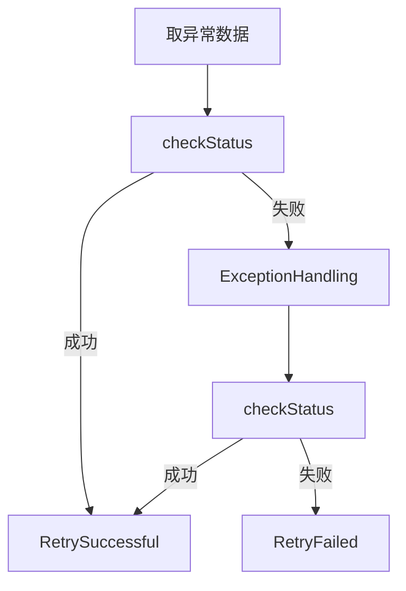
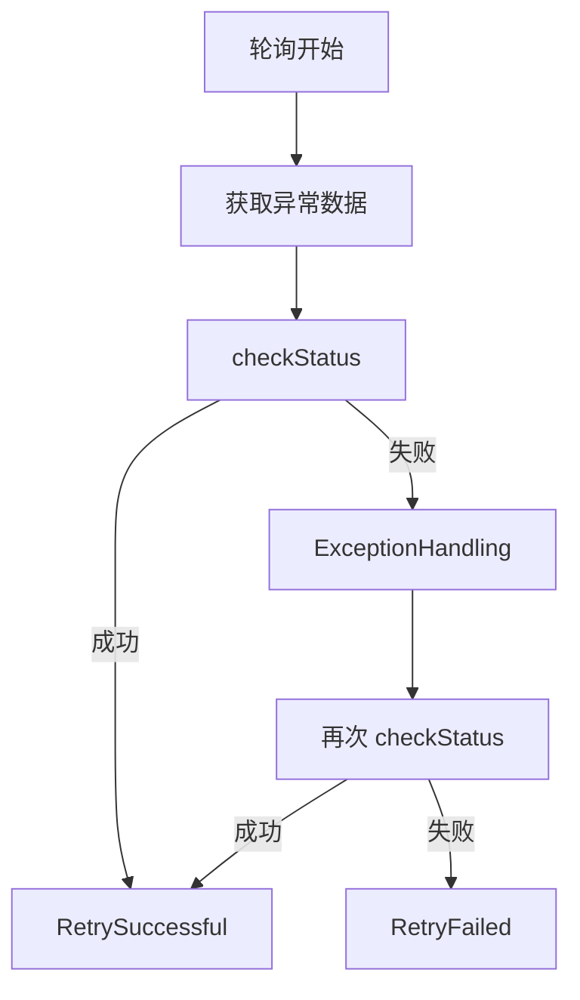

# 异常重试处理矿机框架

**（Abnormal Retry Processing Framework）**

***

## 一、框架目标与设计边界

### 1️⃣ 设计目标

该框架用于解决以下问题：

*   **业务异常自动恢复**
*   **异常统一落库、统一调度、统一重试**
*   **避免异常堆积、雪崩重试**
*   **自动 → 人工 的可控升级**
*   **业务代码最小侵入（注解 + 约定方法）**

### 2️⃣ 框架边界（明确不做的事）

*   ❌ 不负责具体业务逻辑实现
*   ❌ 不关心异常来源（网络 / 三方 / DB / 逻辑）
*   ❌ 不替代事务系统
*   ❌ 不做分布式锁（由业务保证幂等）

**调用者必须实现!!!!**

1.  \*\*在 Service 类上加注解  \*\*
2.  **实现 checkStatus        (判断业务状态的方法)**
3.  **实现 ExceptionHandling   (业务重试的方法)**
4.  **业务入口调用 checkUserErr  (必须调用)**
5.  **提供 ProcessingSuccessful 接口** (给人工调用处理结果)

***

## 二、核心设计模型（强约定）

### 核心原则

> **异常 = 一条业务数据的“未完成状态”**

框架只关心三件事：

1.  **这条数据是否异常**
2.  **是否可以继续自动处理**
3.  **是否需要升级为人工处理**

***

## 三、异常状态模型（统一枚举，强制约束）

### 1️⃣ err\_status（异常主状态）

| 值    | 含义      | 说明     |
| :--- | :------ | :----- |
| 2000 | 正常      | 无异常    |
| 4000 | 异常待自动处理 | 可重试    |
| 4001 | 异常需人工处理 | 自动失败   |
| 2001 | 自动处理成功  | 框架写入   |
| 2002 | 人工处理成功  | 人工接口写入 |

📌 **结论：err\_status 是异常生命周期的唯一状态机**

***

## 四、数据库强制字段规范（闭环）

> **只要使用本框架，以下字段必须存在**

### 1️⃣ 异常控制字段

| 字段名                    | 类型       | 说明         |
| :--------------------- | :------- | :--------- |
| err\_status            | int      | 异常主状态      |
| err\_start\_time       | datetime | 首次异常时间     |
| err\_retry\_count      | int      | 已重试次数      |
| err\_next\_retry\_time | datetime | 下次允许自动重试时间 |
| err\_min\_interval     | int      | 最小重试间隔（秒）  |
| err\_timeout           | int      | 最大处理窗口（秒）  |

### 2️⃣ 人工处理相关字段

| 字段名                            | 类型       | 说明       |
| :----------------------------- | :------- | :------- |
| err\_submit\_manual\_status    | int      | 人工处理状态   |
| err\_next\_remind\_staff\_time | datetime | 下次提醒人工时间 |

人工状态枚举：

| 值    | 含义     |
| :--- | :----- |
| 2000 | 已提交    |
| 4000 | 提交异常   |
| 4002 | 人工处理成功 |

***

## 五、业务状态字段（强制与业务绑定）

### 1️⃣ 注解需提供的业务状态参数

| 参数           | 说明      |
| :----------- | :------ |
| statusField  | 业务状态字段名 |
| successValue | 成功值     |
| failValue    | 失败值     |

📌 **框架判断异常是否结束 = err\_status + 业务状态双校验**

***

## 六、核心注解定义（补全字段）

### `@AbnormalRetryConfig`

```
@Target(ElementType.TYPE)
@Retention(RetentionPolicy.RUNTIME)
public @interface AbnormalRetryConfig {

    /** 数据库表名 */
    String table();

    /** 当前服务中文标签（用于邮件/日志） */
    String serviceName();

    /** 主键字段（默认 id） */
    String idField() default "id";

    /** 用户标识字段 */
    String userField();

    /** 业务状态字段 */
    String statusField();

    /** 业务成功值 */
    String successValue();

    /** 业务失败值 */
    String failValue();

    /** 最小重试间隔（秒） */
    int minIntervalSeconds();

    /** 异常处理超时时间（秒） */
    int timeoutSeconds();

    /** 最大自动重试次数 */
    int maxRetryCount();

    /** 人工提醒间隔（秒） */
    int manualRemindIntervalSeconds();
}

```

✅ **注解信息 = 框架全部运行参数来源**

***

## 七、Service 必须实现的方法（强约定）调用者必须实现

### 1️⃣ 检查状态方法

```
boolean checkStatus(Long dataId);

```

| 结果    | 含义  |
| :---- | :-- |
| true  | 已成功 |
| false | 仍异常 |

***

### 2️⃣ 异常重试处理方法

```
boolean ExceptionHandling(Long dataId);

```

⚠️ **重要规则**

*   重试成功：

    *   必须写入新的业务数据（如果需要）
    *   返回 true
*   重试失败：

    *   不抛异常
    *   返回 false

***

## 八、业务入口强制校验（防雪崩）调用者必须实现

### `checkUserErr`

```java
void checkUserErr(String userValue);

```

#### 校验逻辑

```java
err_status = 4000
OR statusField = failValue

```

#### 行为

*   命中 → **直接抛异常**
*   未命中 → 正常执行业务
*   **结论：这是防止“异常未结束继续堆积”的关键闸门**

***

## 九、人工处理接口（闭环）

### `ProcessingSuccessful`

```json
void ProcessingSuccessful(Long dataId);

```

#### 框架执行内容

*   err\_status → 2002
*   statusField → successValue

📌 **是否写业务数据由人工接口自行决定**

***

## 十、调度服务逻辑（完整闭环）

### 1️⃣ 初始化阶段

1.  扫描 `@AbnormalRetryConfig`
2.  建立：

    *   表 → Service 映射
    *   表 → 注解参数映射
3.  校验字段
4.  **缺失字段 → 自动 ALTER TABLE**

***

### 2️⃣ 轮询任务（默认 5 分钟）

> 间隔从 `yml` 读取

***

## 十一、异常自动处理流程（闭环）

### 自动处理筛选条件（getAllAbnormalData）

```
err_status = 4000
AND (err_next_retry_time IS NULL OR err_next_retry_time <= now)
AND now - err_start_time < timeoutSeconds
AND err_retry_count < maxRetryCount
AND statusField = failValue

```

***

### 自动执行流程（严格顺序）



***

## 十二、RetryFailed 逻辑拆解（关键）

### 条件 1：仍可自动处理

*   更新：

    *   err\_retry\_count += 1
    *   err\_next\_retry\_time = now + 动态退避时间

**动态退避公式（建议）**

```
nextInterval = minIntervalSeconds * err_retry_count

```

***

### 条件 2：自动失败 → 升级人工

```
now - err_start_time > timeoutSeconds
OR err_retry_count >= maxRetryCount

```

行为：

*   err\_status → 4001
*   触发 `sendErrToMail`

***

## 十三、人工通知逻辑（sendErrToMail）

### 邮件内容规范

**标题**

```
【服务名】异常自动处理超限，请人工处理

```

**正文**

```
异常用户：xxx
异常开始时间：xxx
已重试次数：xxx
异常持续时长：xxx 秒

完整数据：
{JSON}

```

***

## 十四、状态流转完整性校验（✅ 闭环）

```
正常(2000)
   ↓
异常发生 → 4000
   ↓
自动成功 → 2001
   ↓
结束

或

自动失败 → 4001
   ↓
人工处理 → 2002
   ↓
结束

```

✔ 无死状态\
✔ 无无法退出路径\
✔ 每条异常最终必达终态

***

***

### **框架开发文档**

***

# 异常重试处理矿机框架

## 实现逻辑（Framework Implementation）

***

## 一、框架定位

*   本框架为 **系统级服务类**
*   常驻运行
*   不参与具体业务
*   仅负责：

    *   异常发现
    *   自动重试调度
    *   状态迁移
    *   人工升级通知

***

## 二、整体生命周期总览

```
系统启动
  ↓
扫描注解 → 建立映射
  ↓
校验并补齐数据库字段
  ↓
启动轮询调度服务
  ↓
自动异常处理
  ↓
自动成功 或 升级人工
  ↓
人工处理成功
  ↓
异常生命周期结束

```

***

## 三、初始化阶段（系统启动时）

### 1️⃣ 扫描异常处理注解类

#### 行为

*   扫描所有标注 `@AbnormalRetryConfig` 的类
*   对每一个类：

    *   解析注解参数
    *   绑定：

        *   **数据库表名**
        *   **Service Bean**
        *   **状态字段规则**
        *   **时间 / 次数控制参数**

#### 结果

构建以下核心内存映射：

```
tableName → AbnormalConfig
tableName → ServiceInstance

```

📌 **该映射是后续一切逻辑的基础**

***

### 2️⃣ 校验数据库结构（强制）

#### 行为

对每一个已映射的数据库表：

*   检查是否包含框架所需字段：

    *   err\_status
    *   err\_start\_time
    *   err\_retry\_count
    *   err\_next\_retry\_time
    *   err\_min\_interval
    *   err\_timeout
    *   err\_submit\_manual\_status
    *   err\_next\_remind\_staff\_time

#### 规则

*   字段不存在 → **自动 ALTER TABLE 添加**
*   字段存在 → 跳过
*   不修改已有字段值

📌 **保证框架运行期不因字段缺失失败**

***

## 四、轮询调度服务

### 1️⃣ 调度方式

*   定时任务（如 `@Scheduled`）
*   默认周期：**5 分钟**
*   周期配置来源：

    *   `yaml` / `yml`
    *   如：`abnormal.retry.scan.interval`

***

### 2️⃣ 每次轮询的总体流程

```
for each 映射的数据库表:
    1. 获取可自动处理异常数据
    2. 对每条数据执行异常处理流程
    3. 获取需要人工通知的数据
    4. 执行人工通知

```

***

## 五、异常自动执行主流程

### 异常自动执行流程图（规范版）



***

## 六、核心方法说明（框架内部）

***

### 1️⃣ getAllAbnormalData

**获取可自动处理的异常数据**

#### 筛选条件（必须全部满足）

```
1. err_status = 4000
2. err_next_retry_time IS NULL OR err_next_retry_time <= 当前时间
3. 当前时间 - err_start_time < timeoutSeconds（注解提供）
4. err_retry_count < maxRetryCount（注解提供）
5. 业务状态字段 = 业务失败值（注解提供）

```

#### 作用

*   **准备自动重试的数据集合**
*   不做任何状态修改

***

### 2️⃣ checkStatus（调用业务方）

#### 行为

*   调用对应 Service 的 `checkStatus(dataId)`

#### 结果解释

| 返回值   | 含义      |
| :---- | :------ |
| true  | 当前数据已成功 |
| false | 当前数据仍异常 |

***

### 3️⃣ RetrySuccessful

**自动处理成功（终态）**

#### 触发条件

*   `checkStatus` 返回 `true`

#### 执行逻辑

*   更新数据库字段：

    *   `err_status = 2001`
    *   业务状态字段 = 成功值（注解提供）

#### 说明

*   不再参与后续轮询
*   异常生命周期结束

***

### 4️⃣ ExceptionHandling（调用业务方）

#### 行为

*   调用业务实现的异常重试逻辑

#### 注意事项（框架假设）

*   业务方：

    *   不抛异常
    *   返回 boolean
*   框架：

    *   不捕获业务异常用于逻辑判断
    *   只看返回值 + 后续 `checkStatus`

***

### 5️⃣ RetryFailed

**自动处理失败（中间态或升级）**

#### 条件一：仍可自动处理

```
err_status = 4000
AND 当前时间 - err_start_time < timeoutSeconds
AND err_retry_count < maxRetryCount

```

#### 执行逻辑（条件一）

1.  err\_retry\_count += 1
2.  计算下次执行时间\
    （重试次数越多，间隔越长）

**推荐公式：**

```
nextInterval = minIntervalSeconds × err_retry_count
err_next_retry_time = 当前时间 + nextInterval

```

***

#### 条件二：自动处理失败 → 升级人工

```
err_status = 4000
AND (
    当前时间 - err_start_time > timeoutSeconds
    OR err_retry_count >= maxRetryCount
)
AND err_next_remind_staff_time < 当前时间

```

#### 执行逻辑（条件二）

1.  err\_status → 4001
2.  调用 `sendErrToMail`
3.  设置下一次人工提醒时间（同样使用退避逻辑）

***

### 6️⃣ getAllAbnormalDataNoticeManually

**获取需要通知人工的异常数据**

#### 筛选条件

```
1. err_status = 4000 或 4001
2. 当前时间 - err_start_time > timeoutSeconds
3. err_retry_count >= maxRetryCount
4. err_next_remind_staff_time < 当前时间
5. 业务状态字段 = 失败值

```

***

### 7️⃣ sendErrToMail

**通知人工处理**

#### 邮件内容

*   标题

    ```
    【服务名】异常自动处理超限，请人工处理

    ```
*   内容包含：

    *   异常用户（userField）
    *   异常开始时间
    *   已重试次数
    *   异常持续时长
    *   完整数据快照（JSON）

#### 通知后处理

*   更新：

    *   `err_next_remind_staff_time = 当前时间 + 动态退避时间`

***

### 8️⃣ ProcessingSuccessful

**人工处理成功（终态）**

#### 触发来源

*   管理后台 / 客服系统 / 运维接口

#### 执行逻辑

*   更新：

    *   `err_status = 2002`
    *   业务状态字段 = 成功值

📌 **异常生命周期正式结束**

***

## 七、状态闭环校验（关键）

### 状态流转图

```
2000 正常
  ↓
4000 异常（自动处理中）
  ↓
2001 自动成功（结束）

或

4001 需人工处理
  ↓
2002 人工成功（结束）

```

### 校验结论

*   ✅ 无死循环
*   ✅ 无无法结束状态
*   ✅ 每条异常必达终态
*   ✅ 自动 / 人工边界清晰

***

## 八、实现层面注意事项（强烈建议）

1.  **所有更新必须幂等**
2.  **轮询内单条数据必须 try-catch 包裹**
3.  **禁止并发处理同一条数据**
4.  **禁止在框架层写业务数据**
5.  **checkStatus 永远是最终裁判**

***

## 九 框架方法表:

| 方法名                              | 含义                        | 执行逻辑                                                                                                                                                                                                                                                                                                                                                                                                                                                                                                      | 作用                   | 参数   | 返回值 |
| :------------------------------- | :------------------------ | :-------------------------------------------------------------------------------------------------------------------------------------------------------------------------------------------------------------------------------------------------------------------------------------------------------------------------------------------------------------------------------------------------------------------------------------------------------------------------------------------------------- | :------------------- | :--- | :-- |
| getAllAbnormalData               | 获取所有已经映射的数据库异常数据          | 筛选条件:1.err\_status=4000 2.err\_*next\_retry\_time=空/null或小于当前时间 3. 当前时间-err\_*start\_time<提供异常处理超时(秒/注解提供)4. err\*\_retry\*\_count<最大重试次数(注解提供) 5.表示状态字段字符串(注解提供)=表示状态失败值                                                                                                                                                                                                                                                                                                                                 | 准备异常数据               | 无    | 无   |
| getAllAbnormalDataNoticeManually | 获取所有已经映射的数据库异常超时需要通知人工的数据 | 筛选条件:1.err\_status=4000 2.当前时间-err\_*start\_*time>提供异常处理超时(秒/注解提供) 3.err\*\_retry\*\_count>最大重试次数(注解提供) 4. err\_*next*\_*remind\_*staff\_time<当前时间 5.表示状态字段字符串(注解提供)=表示状态失败值                                                                                                                                                                                                                                                                                                                              | 准备通知人工数据             | 无    | 无   |
| checkUserErr                     | 获取指定用户的异常记录               | 这个方法时提供给调用者的:获取调用者的类的注解 获取到数据库名 和提供表示状态字段字符串 表示状态成功值 表示状态失败值 查询err\_status=4000或者 表示状态字段字符串(注解提供)=表示状态失败值 如果有则抛出异常:当前操作存在异常请过一会再试试或联系客服                                                                                                                                                                                                                                                                                                                                                                   | 检查是否存在异常未处理 如果有则抛出异常 | 无    | 无   |
| RetrySuccessful                  | 自动处理重试成功                  | 注解类的checkStatus调用 如果成功则执行当前逻辑,获取注解的数据库 表示状态字段字符串(注解提供) 表示状态成功值(注解提供) 修改字段: 1.err\_status:2001 2.表示状态字段字符串(注解提供) 修改为 表示状态成功值(注解提供)                                                                                                                                                                                                                                                                                                                                                                         | 处理成功                 | 数据ID | 无   |
| ProcessingSuccessful             | 人工处理后执行成功                 | 获取注解的数据库 表示状态字段字符串(注解提供) 表示状态成功值(注解提供) 修改字段: 1.err\_status:2002 2.表示状态字段字符串(注解提供) 修改为 表示状态成功值(注解提供)                                                                                                                                                                                                                                                                                                                                                                                                       | 人工处理成功               | 数据ID | 无   |
| RetryFailed                      | 自动处理失败                    | 条件1:1.err\_status=4000 2.err\_*next\_retry\_time=空/null或小于当前时间 3. 当前时间-err\_*start\_time<提供异常处理超时(秒/注解提供)4. err\*\_retry\*\_count<最大重试次数(注解提供) 5.表示状态字段字符串(注解提供)=表示状态失败值 条件1满足则 1.修改err\_*next\_retry\_time 逻辑起始间隔是枚举提供的 设置下次时间需要取当前时间-err\_*start\_time作为下次执行时间(也就是采用重试次数越多 间隔时间越长) 2.err\*\_retry\*\_count自增1 条件2:1.err\_status=4000 2.当前时间-err\_*start\_*time>提供异常处理超时(秒/注解提供) 3.err\*\_retry\*\_count>最大重试次数(注解提供) 4. err\_*next*\_*remind\_*staff\_time<当前时间 5.表示状态字段字符串(注解提供)=表示状态失败值, 条件2满足则通知人工处理 | 自动修改异常状态并且自动处理通知人工   | 数据ID | 无   |
| sendErrToMail                    | 通知人工处理                    | 从yuml配置找到邮箱所需字段,自动构建邮件标题内容发送,需要内容:标题:当前服务的中文标签(注解提供) 自动处理超过上限,请人工处理 内容:异常用户:取用户字段值(注解提供的数据库中用户的字段) (换行) 已经重试次数,异常截止当前时间, 通知人工处理次数 (换行) 完整数据 通知结束后自动将err\_*next*\_*remind\_*staff\_time *设置下次时间需要取当前时间-err\_*start\_time作为下次执行时间(也就是采用重试次数越多 间隔时间越长)                                                                                                                                                                                                                                                       | 发邮件通知人工              | 数据ID | 无   |

